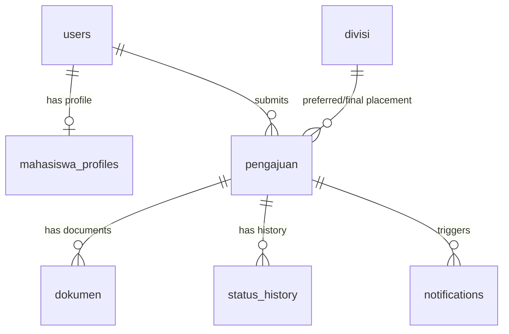

# DATABASE DESIGN — SIMAGANG BAPPEDA LAMPUNG (KOREKSI FINAL)

## Aturan Desain Skema
1. **Tidak Ada Entity Group**: Pengajuan selalu berelasi langsung dengan 1 user mahasiswa.
2. **Kapasitas Bersifat Informasi**: Tabel `divisi` hanya mencatat `kapasitas`, tapi tidak ada *constraint* atau validasi *blocking* pada level database atau aplikasi untuk kuota pendaftaran.
3. **Dokumen Versioning**: Tabel `dokumen` menggunakan field `version` dan `is_current` untuk menyimpan riwayat revisi tanpa menghapus file lama.
4. **Tidak Ada Kolom Periode Global**: Pengajuan mencatat `tanggal_mulai_rencana` dan `tanggal_selesai_rencana`, bukan me-refer ke tabel `periode_magang`.

## Entity Relationship Diagram (ERD) Overview

## Tables

### 1. `users`
- `id` (PK, INT)
- `nama` (VARCHAR 150)
- `email` (VARCHAR 150, UNIQUE)
- `password` (VARCHAR 255)
- `role` (ENUM: 'mahasiswa', 'sekretariat', 'admin')

### 2. `mahasiswa_profiles`
- `id` (PK, INT)
- `user_id` (FK, INT, UNIQUE) -> `users(id)`
- `nim` (VARCHAR 50)
- `universitas` (VARCHAR 150)
- `program_studi` (VARCHAR 150)
- `semester` (INT)
- `nomor_hp` (VARCHAR 20)
- `alamat` (TEXT)

### 3. `divisi`
- `id` (PK, INT)
- `nama_divisi` (VARCHAR 100)
- `deskripsi` (TEXT)
- `kapasitas` (INT) - *Informational only, not blocking*
- `status` (ENUM: 'aktif', 'nonaktif')

### 4. `pengajuan`
- `id` (PK, INT)
- `nomor_pengajuan` (VARCHAR 50, UNIQUE)
- `user_id` (FK, INT) -> `users(id)` (Relasi individu wajib, tidak ada group/tim)
- `divisi_id_preferensi` (FK, INT) -> `divisi(id)`
- `divisi_id_final` (FK, INT, NULLABLE) -> `divisi(id)`
- `tanggal_mulai_rencana` (DATE)
- `tanggal_selesai_rencana` (DATE)
- `tanggal_mulai_aktual` (DATE, NULLABLE)
- `tanggal_selesai_aktual` (DATE, NULLABLE)
- `status` (ENUM: 'draft', 'diajukan', 'dalam_verifikasi', 'revisi', 'diterima', 'ditolak', 'sedang_magang', 'selesai', 'mengundurkan_diri')
- `alasan_penolakan` (TEXT, NULLABLE)
- `catatan_verifikasi` (TEXT, NULLABLE)
- `pembina_lapangan` (VARCHAR 150, NULLABLE)
- `diputuskan_oleh` (FK, INT, NULLABLE) -> `users(id)`
- `diputuskan_at` (TIMESTAMP, NULLABLE)
- `created_at` (TIMESTAMP)

### 5. `dokumen`
- `id` (PK, INT)
- `pengajuan_id` (FK, INT) -> `pengajuan(id)`
- `jenis_dokumen` (ENUM: 'surat_lamaran', 'cv', 'transkrip', 'tambahan', 'surat_penerimaan_final', 'surat_pengunduran_diri', 'dokumen_akhir_magang')
- `file_path` (VARCHAR 255)
- `original_filename` (VARCHAR 255)
- `version` (INT, DEFAULT 1)
- `is_current` (BOOLEAN, DEFAULT TRUE)
- `uploaded_by` (FK, INT) -> `users(id)`
- `created_at` (TIMESTAMP)

### 6. `status_history`
- `id` (PK, INT)
- `pengajuan_id` (FK, INT) -> `pengajuan(id)`
- `status_awal` (VARCHAR 50)
- `status_baru` (VARCHAR 50)
- `changed_by` (FK, INT) -> `users(id)`
- `catatan` (TEXT, NULLABLE)
- `created_at` (TIMESTAMP)

### 7. `notifications`
- `id` (PK, INT)
- `user_id` (FK, INT) -> `users(id)`
- `pengajuan_id` (FK, INT, NULLABLE) -> `pengajuan(id)`
- `pesan` (TEXT)
- `is_read` (BOOLEAN, DEFAULT FALSE)
- `created_at` (TIMESTAMP)

### 8. `audit_logs`
- `id` (PK, INT)
- `user_id` (FK, INT, NULLABLE) -> `users(id)`
- `action` (VARCHAR 100)
- `entity` (VARCHAR 50)
- `entity_id` (INT)
- `details` (TEXT)
- `ip_address` (VARCHAR 45)
- `created_at` (TIMESTAMP)
