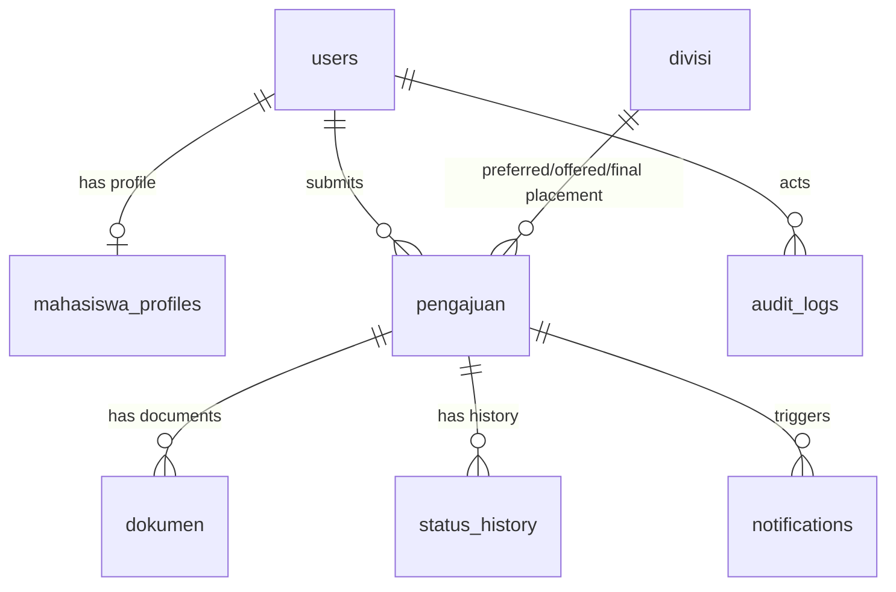

# DATABASE DESIGN — SIMAGANG BAPPEDA LAMPUNG

Sumber kebenaran struktur tabel adalah `database/schema.sql`. Berkas ini
merangkumnya, terakhir disamakan pada 19 Agustus 2026. Perubahan struktur untuk
instalasi yang sudah berjalan dicatat di `database/UPGRADE.sql`.

## Aturan Desain Skema
1. **Tidak Ada Entity Group**: Pengajuan selalu berelasi langsung dengan 1 user mahasiswa.
2. **Kapasitas Bersifat Informasi**: Tabel `divisi` mencatat `kapasitas`, tetapi tidak ada *constraint* maupun validasi *blocking* untuk kuota pendaftaran.
3. **Dokumen Versioning**: Tabel `dokumen` memakai `version` dan `is_current` untuk menyimpan riwayat revisi tanpa menghapus berkas lama.
4. **Tidak Ada Kolom Periode Global**: Pengajuan mencatat `tanggal_mulai_rencana` dan `tanggal_selesai_rencana`, bukan merujuk tabel `periode_magang`.
5. **Nomor Pengajuan Mengikuti Urutan Basis Data**: dibentuk dari id baris (`PM-YYYYMMDD-000123`), bukan angka acak, sehingga dijamin unik.

## Entity Relationship Diagram (ERD) Overview

## Tables

### 1. `users`
- `id` (PK, INT)
- `nama` (VARCHAR 150)
- `email` (VARCHAR 150, UNIQUE)
- `password` (VARCHAR 255) — hash `password_hash()`
- `role` (ENUM: 'mahasiswa', 'sekretariat', 'admin')
- `status` (ENUM: 'aktif', 'nonaktif') — akun nonaktif ditolak saat login
- `reset_token` (VARCHAR 64, NULLABLE) — hash SHA-256, bukan token mentah
- `reset_token_expires` (DATETIME, NULLABLE) — diisi `DATE_ADD(NOW(), INTERVAL 1 HOUR)` oleh MySQL
- `last_login_at` (DATETIME, NULLABLE)
- `created_at`, `updated_at` (TIMESTAMP)
- Indeks: `idx_users_role_status (role, status)`

### 2. `mahasiswa_profiles`
- `id` (PK, INT)
- `user_id` (FK, INT, UNIQUE) -> `users(id)`
- `nim` (VARCHAR 50)
- `tempat_lahir` (VARCHAR 100, NULLABLE)
- `tanggal_lahir` (DATE, NULLABLE)
- `universitas` (VARCHAR 150)
- `fakultas` (VARCHAR 150, NULLABLE)
- `program_studi` (VARCHAR 150)
- `semester` (INT)
- `nomor_hp` (VARCHAR 20)
- `alamat` (TEXT)

Seluruh kolom di atas wajib terisi sebelum mahasiswa boleh mengajukan magang;
daftar acuannya ada di `MahasiswaProfile::FIELD_WAJIB`.

### 3. `divisi`
- `id` (PK, INT)
- `nama_divisi` (VARCHAR 100)
- `deskripsi` (TEXT)
- `kapasitas` (INT) — *informasi saja, tidak memblokir*
- `status` (ENUM: 'aktif', 'nonaktif')

### 4. `pengajuan`
- `id` (PK, INT)
- `nomor_pengajuan` (VARCHAR 50, UNIQUE)
- `user_id` (FK, INT) -> `users(id)`
- `divisi_id_preferensi` (FK, INT) -> `divisi(id)` — pilihan mahasiswa, mengunci penempatan bila diterima langsung
- `divisi_id_tawaran` (FK, INT, NULLABLE) -> `divisi(id)` — hanya terisi bila Sekretariat menawarkan divisi lain
- `divisi_id_final` (FK, INT, NULLABLE) -> `divisi(id)` — hasil akhir; menyalin preferensi atau tawaran yang disetujui
- `tanggal_mulai_rencana`, `tanggal_selesai_rencana` (DATE)
- `tanggal_mulai_aktual`, `tanggal_selesai_aktual` (DATE, NULLABLE)
- `status` (ENUM: 'draft', 'diajukan', 'dalam_verifikasi', 'revisi', 'menunggu_konfirmasi_tawaran', 'menunggu_finalisasi_sekretariat', 'diterima', 'ditolak', 'dibatalkan_oleh_mahasiswa', 'sedang_magang', 'selesai', 'mengundurkan_diri')
- `alasan_penolakan`, `catatan_verifikasi` (TEXT, NULLABLE)
- `pembina_lapangan` (VARCHAR 150, NULLABLE)
- `diputuskan_oleh` (FK, INT, NULLABLE) -> `users(id)`
- `diputuskan_at` (TIMESTAMP, NULLABLE)
- `created_at`, `updated_at` (TIMESTAMP)
- Indeks: `idx_pengajuan_status`, `idx_pengajuan_dibuat (created_at)`, `idx_pengajuan_user_status (user_id, status)`

Peta transisi status yang sah didefinisikan di `StatusService::$allowedTransitions`
dan wajib cocok dengan ENUM di atas.

### 5. `dokumen`
- `id` (PK, INT)
- `pengajuan_id` (FK, INT) -> `pengajuan(id)`
- `jenis_dokumen` (VARCHAR 100)
- `file_path` (VARCHAR 255)
- `original_filename` (VARCHAR 255)
- `version` (INT, DEFAULT 1)
- `is_current` (BOOLEAN, DEFAULT TRUE)
- `uploaded_by` (FK, INT) -> `users(id)`
- `created_at`, `updated_at` (TIMESTAMP)

### 6. `status_history`
- `id` (PK, INT)
- `pengajuan_id` (FK, INT) -> `pengajuan(id)`
- `status_awal`, `status_baru` (VARCHAR 50)
- `changed_by` (FK, INT) -> `users(id)`
- `catatan` (TEXT, NULLABLE)
- `created_at` (TIMESTAMP)

### 7. `notifications`
- `id` (PK, INT)
- `user_id` (FK, INT) -> `users(id)`
- `pengajuan_id` (FK, INT, NULLABLE) -> `pengajuan(id)`
- `pesan` (TEXT)
- `is_read` (BOOLEAN, DEFAULT FALSE)
- `created_at` (TIMESTAMP)
- Indeks: `idx_notif_user_baca (user_id, is_read)`

### 8. `login_attempts`
Menopang pembatasan laju login: 5 percobaan gagal per kombinasi email dan
alamat IP dalam 15 menit. Baris dihapus begitu login berhasil.

- `id` (PK, INT)
- `email` (VARCHAR 150)
- `ip_address` (VARCHAR 45)
- `attempted_at` (TIMESTAMP)
- Indeks: `idx_email_waktu (email, attempted_at)`, `idx_ip_waktu (ip_address, attempted_at)`

### 9. `audit_logs`
- `id` (PK, INT)
- `user_id` (FK, INT, NULLABLE) -> `users(id)`
- `action` (VARCHAR 100)
- `entity` (VARCHAR 50), `entity_id` (INT)
- `details` (TEXT)
- `ip_address` (VARCHAR 45)
- `created_at` (TIMESTAMP)
- Indeks: `idx_audit_dibuat (created_at)`, `idx_audit_entitas (entity, entity_id)`
